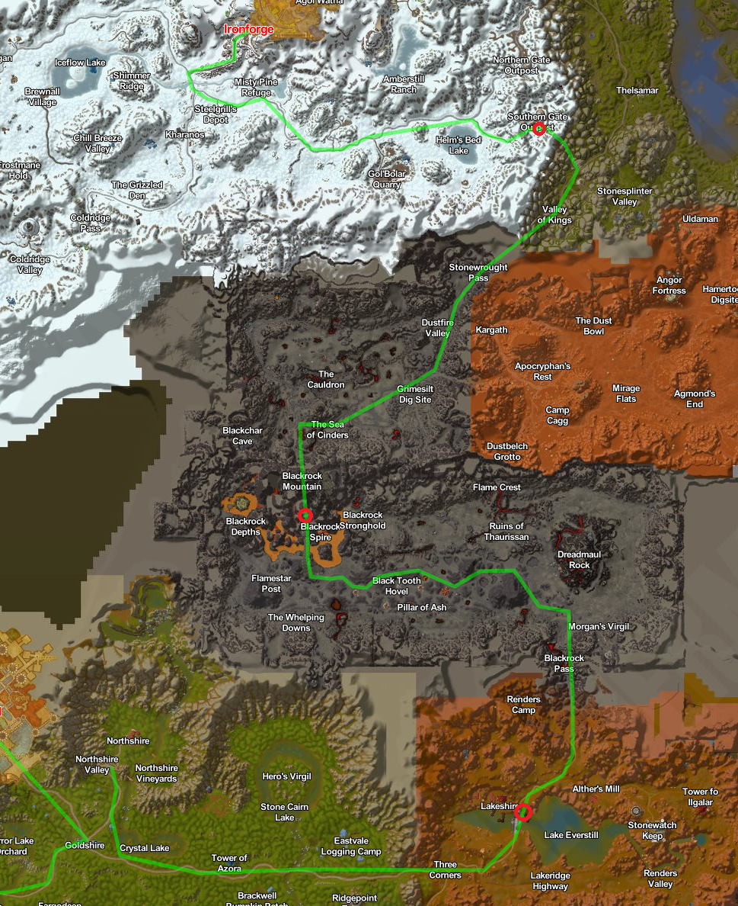
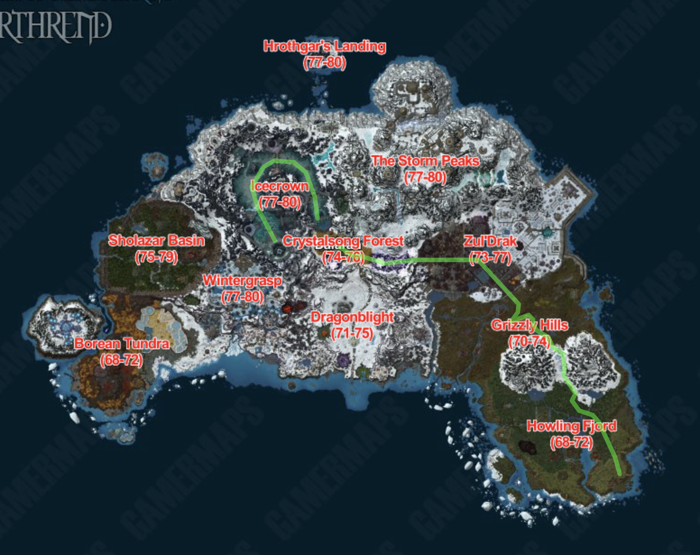
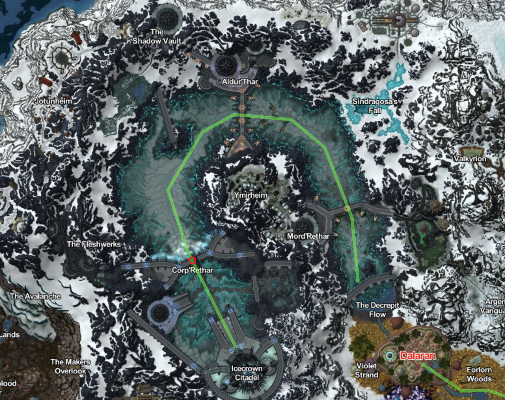
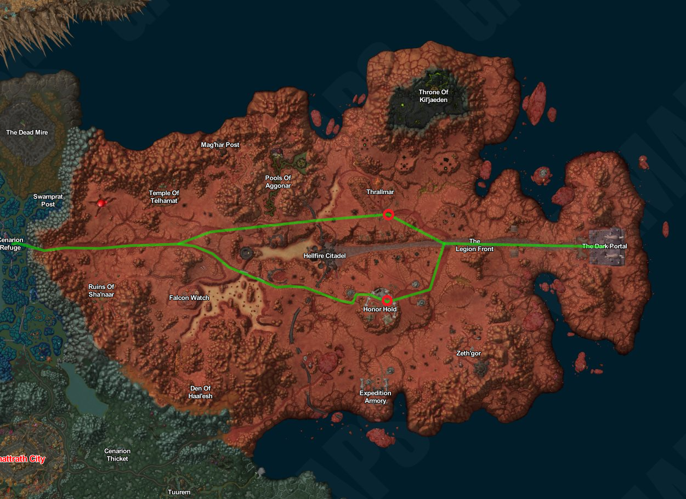
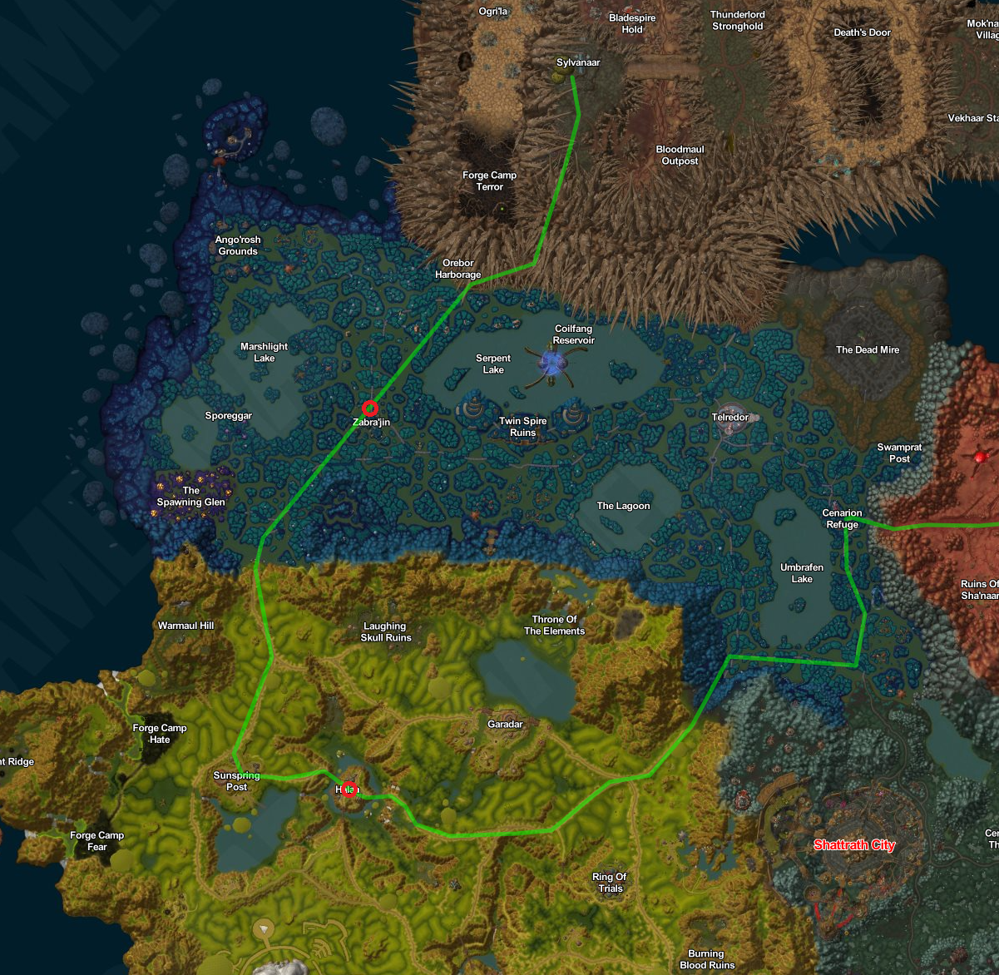
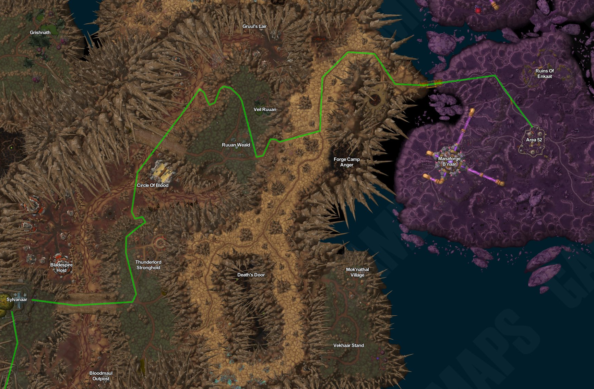
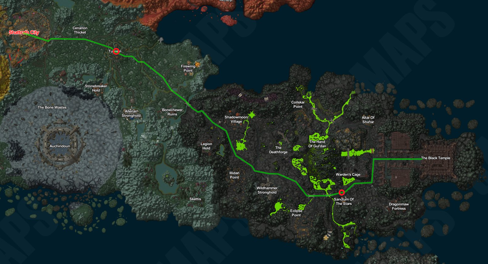

# Introduktion til Turen

Velkommen til den ekstraordinære verden af Tour de Azeroth - en unik begivenhed, hvor helte deltager i et dristigt løb til fods gennem det enorme Azeroth og tilhørende outlands! 
For både erfarne eventyrere og nybegyndere i World of Warcraft, byder Tour de Azeroth på en spændende præsentation af udholdenhed, tapperhed og beslutsomhed, der vil efterlade dig i ærefrygt. 

Oprindeligt opstået for at fremvise ånden af udforskning og konkurrence, er Tour de Azeroth blevet en årlig tradition, der værdsættes af beboerne i denne fantastiske verden. Løbet fører deltagerne på en udfordrende rejse gennem Azeroths forskelligartede landskaber, fra fredelige skove og majestætiske bjerge til brændende ørkener og fortryllende byer.

Selvom løbet drejer sig om individuelle præstationer, er fællesskab en vigtig del af Tour de Azeroth. Deltagerne danner ofte impromptu-teams, der støtter og opmuntrer hinanden gennem den opslidende rejse. Bånd knyttes i fælles prøvelser og triumfer, der fremmer en følelse af enhed blandt løberne.

I hjertet af Tour de Azeroth ligger jagten på de prestigefyldte "Azerothiske gule støvler," en symbolsk pris tildelt løbets leder. De eftertragtede støvler symboliserer ikke kun atletisk dygtighed, men også ånden af eventyr og beslutsomhed, der kendetegner mesterne i Azeroth.

Mere end bare et løb fejrer Tour de Azeroth den levende kultur og de forskellige folkeslag i denne utrolige verden. Når karakterer krydser kontinenterne, bliver de præsenteret for betagende udsigter, gamle ruiner og skjulte vidundere, der viser Azeroths store vidder og skønhed.

Så gør dig klar med dine løbesko, saml dit mod og tag med på dette spændende eventyr, når vi begiver os ud på Tour de Azeroth! Uanset om du er en erfaren eventyrer eller en nysgerrig nybegynder, lover dette ekstraordinære løb en uforglemmelig oplevelse, fyldt med heltemod, fællesskab og den urokkelige ånd hos Azeroths beboere. Kom og vær med, lad den store rejse begynde!

# Regler

Tour de Azeroth er 

## Normalt Løb

Ved et normalet løb starter alle deltager på samme tid og løber mod målstregen. 

## Sprint

Ved et sprint starter deltaer individuelt. dvs. den næste deltager må første starte når den tidligere deltager er nået i mål. 

## Tid

Når løbet starter startes en timer. Denne slutter når en deltageren kryder målstregen. Disse tider bliver skrevet i et etape tids ark hvor den overall tid bliver tracket. 

### Etape tider

Etape tids arket kan findes på følgende 

## Obligatorisk Checkpoints

## Død

Turen gennem Azeroth er en farlig udfordring. Hvis en deltager mister livet undervejs, har deltageren mulighed for at genoplive sig selv.
Ved den anden død vil deltageren blive elimineret fra den pågældende etape, og deltagerens status for etapen vil blive angivet som DNF (Did Not Finish).

Hvis deltageren vælger ikke at benytte sig af genoplivningsmuligheden, vil de automatisk blive gemt til næste etape. Hver deltager har en maksimal grænse på 3 genoplivninger til rådighed på et givent tidspunkt af turen gennem Azeroth.

### Did not finish DNF

Hvis en deltage ikke fuldføre et løb vil hans tid blive den ellers dårligste deltagers tid plus 30 sekunder. 

## Støvler

I Tour de Azeroth er der 3 Støvler. Disse er de eftertragtede `Azerothiske Gule Støvler`, de `Røde Blackrock Støvler` og de `Grønne Teldrassil Etape vinder støvle`. 
Disse støvler kan blive givet til din helt ved følgende command:

````
.bla bla
````

# Macros

### GM Commands

En udtømmelige liste af GM Commands kan findes på [AZCore](https://www.azerothcore.org/wiki/gm-commands) hjemmeside.

# Etaper

Turen er delt op i en række etaper. Disse for fordelt på 

* Etape 1-5 som foregår på *Easten Kingsomds*. 
* Etape 6-7 som forgår i Norhrend
* Etape 8-11 som forgår i Outlands
* Etape 12-17 som forgår i Kalmidor

## Easton Kingsomds


### Etape 1 Booty Bay til Stormwind

#### Introduktion

Rejsen fra Booty Bay til Stormwind er en eventyrlig færd gennem nogle af Azeroths mest ikoniske og stemningsfulde områder. Vi begynder vores rejse ved kysten af Booty Bay, hvor den salte havluft fylder vores lunger, og piraternes skæve skibe skaber en livlig atmosfære.

Fra Booty Bay fører vejen os gennem den mystiske og farlige jungle i Stranglethorn Vale. Skinnende lianer slynger sig fra træ til træ, og øredøvende lyde af vilde skabninger runger i skoven. Her skal vi være på vagt, da farer lurer i hver skygge.

Efter at have krydset Stranglethorn Vale, åbner landskabet sig op i Duskwood, og en atmosfære af uhygge og mystik omslutter os. Tætte tåger svæver mellem de mørke træer, og stemningen føles som taget ud af et uhyggeligt eventyr. Det er en rejse gennem en skov, hvor spøgelser og mareridt synes at leve side om side.

Fra Duskwood rejser vi videre til Sentinel Hill i Westfall, hvor vi bydes velkommen af et åbent landskab og gyldne marker. Sentinel Hill står som en bastion af håb og beskyttelse, mens det omkringliggende landskab er præget af de udfordringer, regionen har stået overfor. Landmændene kæmper for at genvinde deres tabte jord, og stærke allierede står vagt mod trusler.

Videre går turen til Goldshire, en idyllisk landsby omgivet af den grønne skov. Livligheden i byens taverne og handlende skaber en varm og velkommen atmosfære. Her står unge eventyrere side om side med erfarne helte, alle med deres egen unikke historie og mål.

Endelig nærmer vi os Stormwind, Alliance storslåede hovedstad. Den majestætiske Stormwind Keep og de svungne brostensgader viser os stoltheden og styrken i Alliance rige. Byen summer af aktivitet og forskellige folkeslag, hvilket giver os en følelse af at være en del af noget større.

Rejsen fra Booty Bay til Stormwind tager os med gennem en række kontrasterende landskaber og stemninger. Fra den farlige Duskwood til den håbefulde Westfall og den hyggelige Goldshire. Det er en rejse fyldt med eventyr, udfordringer og en følelse af at være en del af Azeroths rige historie.

#### Obligatorisk Checkpoint

* Gurubashi Arena
* Raven Hill
* Sentinel Hill
* Goldshire

##### Start

````
.tele es1
````

##### Slut

````
.tele ee1
````

#### Kort


### Etape 2 Northsire til Ironforge

#### Introduktion

Rejsen fra Northshire Valley til Ironforge er en episk færd gennem nogle af Azeroths mest udfordrende og ikoniske områder. Vi begynder vores rejse fra den fredelige dal i Northshire, hvor lyden af bækkens rislen og den grønne natur danner en idyllisk baggrund.

Vi begiver os ind i Lakeshire, hvor søen glimter som en juvel, og byen hviler ved bredden med en varm og velkommen atmosfære.

Fra Lakeshire fører vejen os til Blackrock Mountain, en frygtindgydende vulkan, der stiger som en truende skygge. Vi er nu på vej ind i fjendeland, hvor ondskab og udfordringer venter. Det er her, vi vil konfrontere de frygtede Blackrock orcs der lurer i dybet af bjerget.

Efter at have krydset Blackrock Mountain, løber turen igennem det berygtede Searing Gorge, hvor flammer danser mellem smedjer og fabrikker. Dette landskab af evig ild er både skræmmende og betagende, og vi må navigere omhyggeligt for at undgå de farer, der er skjult i denne brændende verden.

Vi nærmer os nu Southern Gate Outpost, en militærpost, der vogter over indgangen til Ironforge. Den sidste strækning af vores rejse er præget af spænding og forventning, da vi kan ane den storslåede by i horisonten.

Endelig ankommer vi til Ironforge, dværgenes storslåede hovedstad, der ligger dybt inde i bjergene. De massive søjler og udførlige arkitektur er et vidnesbyrd om dværgenes dygtighed og styrke. Byen pulserer af aktivitet, og vi er omgivet af varme og gæstfrihed.

Rejsen fra Northshire Valley til Ironforge er en oplevelse af mod, eventyr og opdagelse. Gennem Lakeshire, Blackrock Mountain, Searing Gorge og Southern Gate Outpost møder vi udfordringer og farer, men belønningen er en følelse af triumf og ærefrygt, når vi endelig ankommer til den storslåede Ironforge.

#### Items

For at kunne åbne porten i `Stonewrought Pass` skal der benyttes en nøgle. Denne kan tilføjes til din taske ved:

````
.add item 5396
````

#### Obligatorisk Checkpoint

* Lakeshire
* Blackrock Mountain
* Southern Gate outpost

#### Kort



### Etape 3 Thelsamar til Undercity

#### Introduktion

Rejsen fra Thelsamar til Undercity er en lang og udfordrende færd gennem flere af Azeroths farlige og mystiske områder. Vi begynder vores rejse fra Thelsamar, en bosættelse omgivet af bjerge og mineralrige klipper.

Vi begiver os ind i Wetlands, hvor vådområderne strækker sig så langt øjet kan se. Det er en sumpet og uforudsigelig region, hvor farer lurer i mørket, og vi må krydse rickety broer og snørklede stier for at fortsætte vores rejse.

Fra Wetlands fører vejen os gennem Arathi Highlands, et vidtstrakt område med bølgende bakker og frodige græsarealer. Snart stiger terrænet, og vi står over for Thoradin's Wall, en kolossal fæstning bygget af menneskerne for at beskytte mod fjendtlige trusler.

Efter at have krydset Thoradin's Wall går turen videre til Hillsbrad Foothills, et landskab, der er præget af konflikt og krig. Den tidligere fredelige region er nu blevet omvandlet til et slagmark, hvor Alliancen og Horden kæmper om herredømmet. Vi må passere forsigtigt og undgå konflikten.

Derefter fører vejen os ind i Silverpine Forest, en skov indhyllet i tåger og mystik. Her står Pyrewood Village, en by hjemsøgt af forbandelser og uhyggelige skabninger. Vi må bevæge os gennem de mørke gader med forsigtighed, da vi ikke ved, hvad der venter i skyggerne.

Endelig nærmer vi os Undercity, en dystopisk og forfalden by, der ligger under jorden. Undercity er hjemsted for de Undeads og ledet af den magtfulde Banshee-dronning Sylvanas. Byen emmer af mørke kræfter og hemmeligheder og er en farlig destination for de uforberedte.

Rejsen fra Thelsamar til Undercity er en færd gennem kontrasterende landskaber og farlige områder. Gennem Wetlands, Arathi Highlands, Thoradin's Wall, Hillsbrad Foothills, Silverpine Forest og Pyrewood Village oplever vi en verden fyldt med eventyr, udfordringer og mystik. Vores mod og udholdenhed vil blive sat på prøve, når vi udforsker Azeroths utæmmede skønhed og uhyggelige hemmeligheder.

#### Obligatorisk Checkpoint

* Thoradin Wall
* Purewood Village

#### Kort


### Etape 4

#### Introduktion

#### Obligatorisk Checkpoint

#### Kort


### Etape 5 Deathscare(Sprint)

#### Introduktion

#### Obligatorisk Checkpoint

#### Kort


## Northrend



### Etape 6 Explores League Outpost to Dalaran

#### Introduktion

#### Obligatorisk Checkpoint

#### Kort


### Etape 7 Icecrown (Sprint)

#### Introduktion

#### Obligatorisk Checkpoint

#### Kort



## Outlands

Nu går turen til Outland - en verden af magi, teknologi og skæbne. Fra den idylliske oase i Cenarion Refuge til de imponerende Blade's Edge Mountains, videre gennem det futuristiske Netherstorm til det dystre The Black Temple i Shadowmoon Valley. Denne beskrivende rejse vil udfordre din mod, vække din nysgerrighed og tage dig med på en oplevelse fyldt med skønhed og mystik.


### Etape 8 (Sprint) The Dark Portal til Cenarion Refuge

#### Introduktion

Rejsen fra The Dark Portal til Cenarion Refuge er en episk odyssé gennem det frodige og farlige landskab i Outland. Ved The Dark Portal, der står som en majestætisk, forvrænget portal mellem Azeroth og Outland, begynder vores eventyr. Stedet emmer af historie og drama, som området engang var et afgørende punkt for horder af dæmoniske invasionsstyrker, der trængte ind i Azeroth.

Vores første skridt fører os gennem det ødelagte Hellfire Peninsula, hvor udtørrede, knuste landskaber står i skarp kontrast til den buldrende lavas sprøjtende glød. Sorte, tornede skygger trækker deres spor i jorden, og et atmosfære af hårdhed omgiver os, mens vi bevæger os dybere ind i Outlands hjerte.

Efterhånden som vi forlader det dystre Hellfire Peninsula, åbner den spredte grønne vegetation sig som en oase i det golde landskab. Vi betragter med ærefrygt den himmelstræbende Blade's Edge Mountains, hvor massive klipper står som monumenter over tidens forandringer. Disse bjerge beskytter det bortgjemte græsland, Zangarmarsh, som vi nærmer os.

Zangarmarsh byder os velkommen med et hav af smaragdgrønne vandmasser og sumpede områder, der er hjemsted for utallige eksotiske planter og skabninger. Flydende paddehatte svæver som skæve kasketter på vandets overflade, mens glødende svampe lyser som lanterner i mørket. En harmonisk, men alligevel skrøbelig balance, findes i dette unikke økosystem.

Vi nærmer os Cenarion Refuge, og stemningen skifter igen. En følelse af ro og harmoni fylder luften, når vi træder ind i dette naturlige tilflugtssted. Den smukke og fredelige lagune, hvor det luminescerende vand spejler stjernerne om natten, giver en følelse af magi og trylleri. Her møder vi også de beskyttende druider fra Cenarion Circle, der vogter over denne skrøbelige oase.

Rejsen fra The Dark Portal til Cenarion Refuge er en udfordrende, men også en vidunderlig rejse gennem Outlands mangfoldige landskaber. Den byder på alt fra dystre og øde områder til frodige skove og betagende sumpområder. Det er en prøvelse af mod og udholdenhed, men også en opdagelsesrejse fyldt med fascination og ærefrygt for denne enestående verden.

#### Obligatorisk Checkpoint

#### Kort



### Etape 9 Cenarion Refuge til Sylvanaar

#### Introduktion

Rejsen fra Cenarion Refuge til Sylvanaar er en uforglemmelig ekspedition gennem den majestætiske verden af Nagrand i Outland. Vi begynder vores færd fra den rolige oase i Cenarion Refuge, hvor den beroligende lyd af klukkende vand og fuglesang ledsager os på vores vej.

Vi forlader den fredelige lagune bag os og bevæger os ind i Nagrand, hvor det frodige græsland strækker sig så langt øjet kan se. Græsset bølger som en endeløs hav af grønt, hvor vilde kreaturer græsser i harmoni. Den varme, blide brise bærer duften af vilde blomster og naturens renhed.

Snart ser vi den store fæstning Halaa i det fjerne. Dette gamle bastion står stolt midt i Nagrand, og dets ruiner vidner om fortidens stridigheder. Vi nærmer os, og omgivelserne bliver mere spændte. Ruinernes forladte stemning blander sig med en aura af mystik og ærefrygt.

Efter at have udforsket Halaa og ladet dets historie synke ind, fortsætter vi vores rejse gennem det kuperede terræn. Den udfordrende stigning belønner os med en betagende udsigt fra toppen. Sylvanaar venter stadig i horisonten, som en træby, der synes at være et fredeligt tilflugtssted midt i denne vilde natur.

Inden vi når Sylvanaar, tager vi en afstikker til Zabra'jin, der ligger i Zangarmarsh. Her bliver vi mødt af et landskab, der er helt anderledes end det tidligere. Vandet, der glimter som smaragder, omgiver os, og flydende paddehatte svæver som skæve kasketter på vandets overflade. Den sumpede atmosfære skaber en mystisk kulisse for vores rejse.

Efter at have udforsket Zabra'jin og beundret dets unikke charme, fortsætter vi videre mod Sylvanaar. Da vi nærmer os, bliver vi budt velkommen af duften af træ og en følelse af varme fra dens indbydende indbyggere. Byen er omgivet af stolte træer, der danner en naturlig barriere og giver en følelse af tryghed og beskyttelse. Selve byen emmer af aktivitet, og beboerne går rundt med et venligt smil og glæde.

Turen fra Cenarion Refuge til Sylvanaar gennem Halaa og Zabra'jin er en unik rejse gennem Outlands mangfoldige landskaber. Fra Nagrands frodige græsland til Zangarmarsh' sumpede områder oplever vi naturens forskellighed og Outlands rige historie og kultur. Det er en rejse fyldt med opdagelser, eventyr og en fordybelse i naturens vidunderlige skaberværk.

#### Obligatorisk Checkpoint

#### Kort



### Etape 10 Sylvanaar til Area 52

#### Introduktion

Rejsen fra Sylvanaar til Area 52 er en spændende og futuristisk færd gennem Outlands forrevne landskaber. Efter at have forladt Sylvanaar, forsvinder de grønne skovområder gradvist, og vi begiver os ind i Blade's Edge Mountains. Bjergene rejser sig majestætisk omkring os, og vi følger en snoet sti, der fører os højere og højere op i højderne.

Mens vi klatrer, ændrer landskabet sig drastisk. Grønne områder erstattes af golde klippeformationer, og vi bliver vidne til enestående klippesider og afgrunde, der vil tage pusten fra enhver. Men denne barske skønhed er også ledsaget af en følelse af afsideshed og ensomhed, da kun de mest eventyrlystne drister sig ind i disse udfordrende territorier.

Efter at have kæmpet os igennem Blade's Edge Mountains, begynder omgivelserne at skifte igen, når vi nærmer os Netherstorm - det område, hvor Area 52 befinder sig. Den blålige himmel bliver gradvist erstattet af elektrisk glødende skyer, og vi kan mærke den spændende følelse af teknologisk fremgang i luften.

Når vi træder ind i Netherstorm, mødes vi af en surrealistisk og futuristisk verden. Flyvende skibe svæver i horisonten, og lyn og energistråler danser omkring os. Vi står over for mageløse skaber, der virker som noget fra en anden verden. Området er præget af avanceret teknologi og arcanas kraft, og det er tydeligt, at vi er trådt ind i et område, hvor videnskab og magi forenes.

Endelig ser vi Area 52 i al sin pragt. Dette avancerede forskningskompleks er hjertet af Netherstorm og en kilde til innovation og opdagelse. En intens aktivitet hersker omkring os, da videnskabsfolk og teknikere arbejder sammen om at afdække Outlands hemmeligheder.

Rejsen fra Sylvanaar til Area 52 er en bemærkelsesværdig rejse gennem en mangfoldig verden, hvor naturens rå skønhed møder futuristisk teknologi og arkana magi. Fra bjergtoppe til elektrisk glødende landskaber får vi et glimt af Outlands utrolige variation og fascinerende kultur. Det er en rejse fyldt med eventyr, udfordringer og en fordybelse i Outlands unikke vidundere.

#### Obligatorisk Checkpoint

#### Kort



### Etape 11 Shattrath City til The Black Temple

#### Introduktion

Rejsen fra Shattrath City til The Black Temple er en afgørende og skæbnesvanger færd gennem Outland. Shattrath City, byen med sine blendende tårne og fortryllende arkitektur, udstråler en aura af fred og forening, da det er et sted, hvor både Alliance og Horde kan finde ly og samles i harmoni.

Vi begiver os ud af byens beskyttende mure og begynder vores rejse mod The Black Temple, der ligger i Shadowmoon Valley. Vejen fører os gennem en række betagende landskaber, hvor det golde terræn fra Terokkar Forest gradvist bliver erstattet af den mørke og mystiske aura i Shadowmoon Valley.

Som vi bevæger os dybere ind i dalen, er det som om, tiden går i stå. Mørke træer og mystiske stenformationer omgiver os, og atmosfæren bliver tæt med en følelse af historie og skæbne. En dyster ro hersker i området, men en ubestridelig styrke trænger sig på, da vi nærmer os The Black Temple.

The Black Temple står som en skræmmende bastion af ondskab og mørke. Bygget ind i klipperne, virker det som en uigennemtrængelig fæstning. Dette dystre sted er hjemsted for Illidan Stormrage, en magtfuld og kontroversiel skikkelse, der har skabt frygt og fascination i Outland.

Det er en rejse gennem et landskab præget af både skønhed og dystre hemmeligheder. Det er en rejse, der vil teste os, udfordre os og vise os, hvad vi er i stand til, når vi konfronteres med det uventede og det farlige. Rejsen fra Shattrath City til The Black Temple er en episk færd, der vil efterlade et uudsletteligt aftryk på vores sjæle og forankre os endnu dybere i Outlands rige historie og magiske verden.

#### Obligatorisk Checkpoint

#### Kort



## Kalimdor

### Etape 12 Gadgetzan to Diremall

#### Introduktion

#### Obligatorisk Checkpoint

#### Kort

### Etape 13

#### Introduktion

#### Obligatorisk Checkpoint

#### Kort

### Etape 14

#### Introduktion

#### Obligatorisk Checkpoint

#### Kort

### Etape 15

Thunderbluff to Orgrima Main gate
Water walking from theramore to kolkar crag.

#### Introduktion

#### Obligatorisk Checkpoint

#### Kort

### Etape 16 Orgrima to Darkwhisper Gorge.

#### Introduktion

#### Obligatorisk Checkpoint

#### Kort

### Etape 17 (Sprint) Mount hyjal entrance to corpse of achimon.

#### Introduktion

#### Obligatorisk Checkpoint

#### Kort

\#todo 

* [ ] Create tele locations for each etape.
* [ ] Create start and stop flags at each etape
* [ ] læs korrektur på tekst
