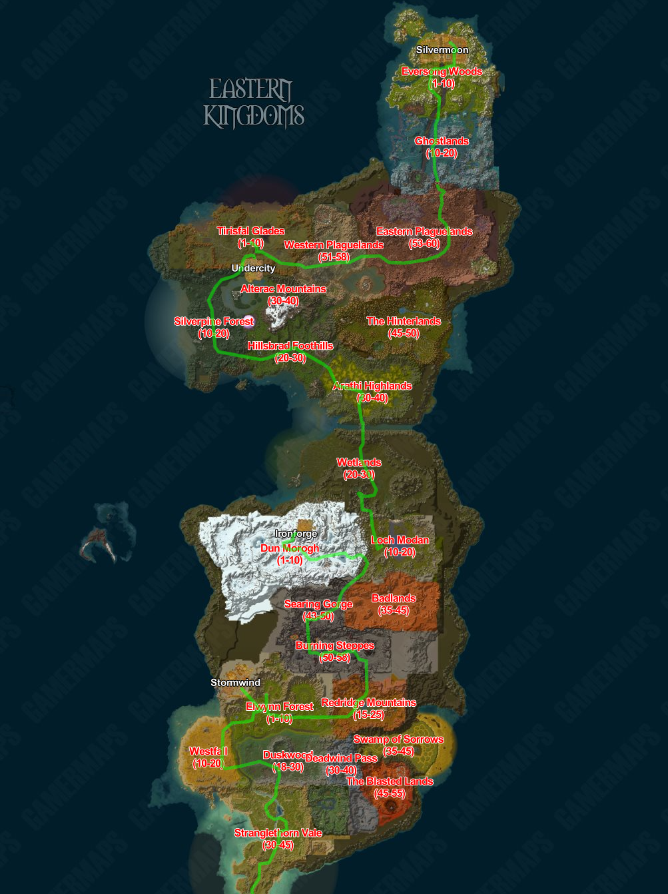
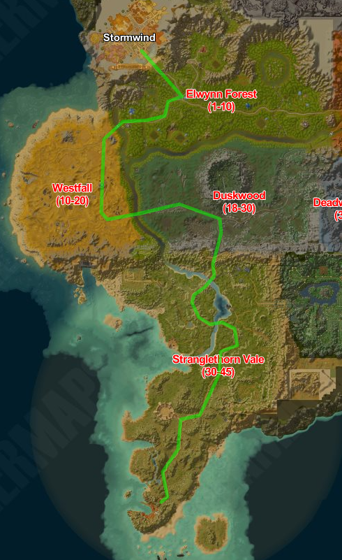
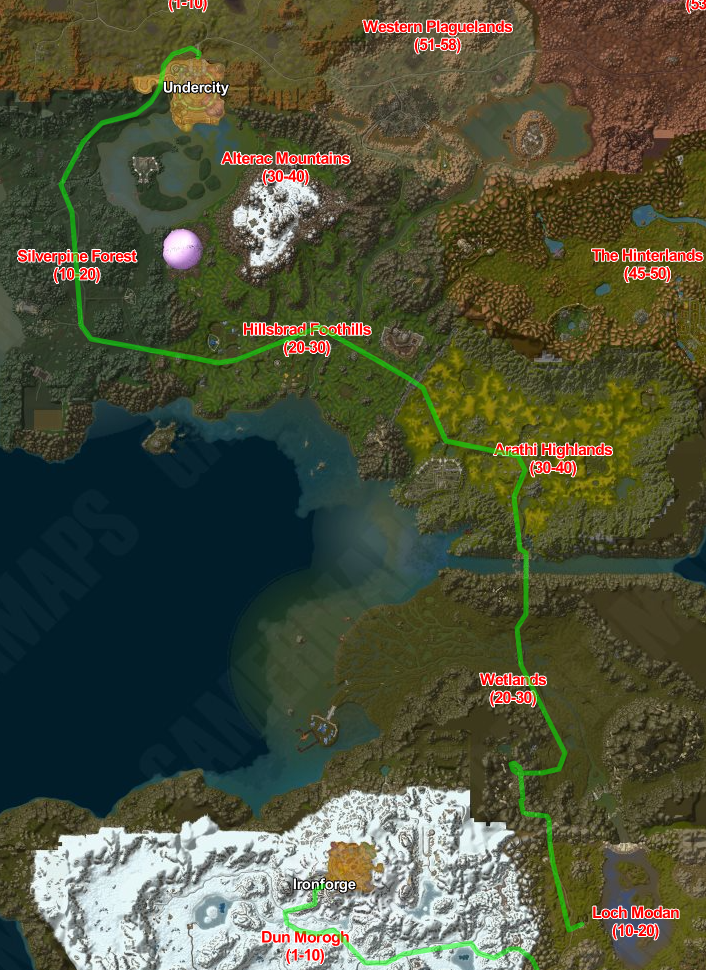
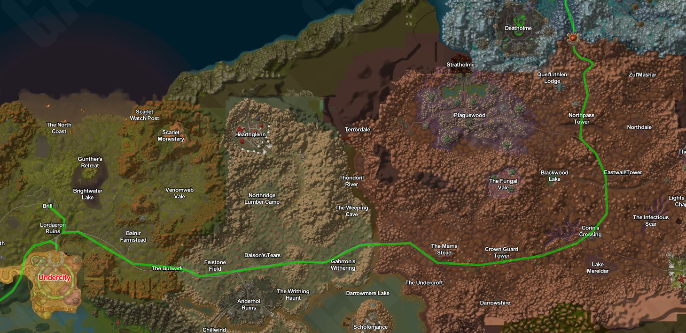
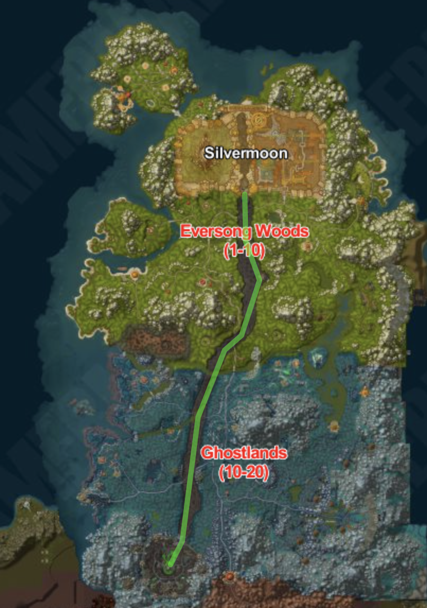

# Easton Kingdoms

## Introduktion

Nu begiver vi os ind i Eastern Kingdoms - et rige fyldt med historie, kultur og konflikt. Vores rejse vil føre os fra den majestætiske Stormwind City's travle gader, gennem de udfordrende landskaber af Blackrock Mountain og ind i det dystre Undercity og til sidst gennem The Deathscar. Denne rejse vil teste vores udholdenhed, vække vores nysgerrighed og tage os på en oplevelse fyldt med mangfoldighed og dramatik.


### Etape 1 Booty Bay til Stormwind

#### Introduktion

Rejsen fra Booty Bay til Stormwind er en eventyrlig færd gennem nogle af Azeroths mest ikoniske og stemningsfulde områder. Vi begynder vores rejse ved kysten af Booty Bay, hvor den salte havluft fylder vores lunger, og piraternes skæve skibe skaber en livlig atmosfære.

Fra Booty Bay fører vejen os gennem den mystiske og farlige jungle i Stranglethorn Vale. Skinnende lianer slynger sig fra træ til træ, og øredøvende lyde af vilde skabninger runger i skoven. Her skal vi være på vagt, da farer lurer i hver skygge.

Efter at have krydset Stranglethorn Vale, åbner landskabet sig op i Duskwood, og en atmosfære af uhygge og mystik omslutter os. Tætte tåger svæver mellem de mørke træer, og stemningen føles som taget ud af et uhyggeligt eventyr. Det er en rejse gennem en skov, hvor spøgelser og mareridt synes at leve side om side.

Fra Duskwood rejser vi videre til Sentinel Hill i Westfall, hvor vi bydes velkommen af et åbent landskab og gyldne marker. Sentinel Hill står som en bastion af håb og beskyttelse, mens det omkringliggende landskab er præget af de udfordringer, regionen har stået overfor. Landmændene kæmper for at genvinde deres tabte jord, og stærke allierede står vagt mod trusler.

Videre går turen til Goldshire, en idyllisk landsby omgivet af den grønne skov. Livligheden i byens taverne og handlende skaber en varm og velkommen atmosfære. Her står unge eventyrere side om side med erfarne helte, alle med deres egen unikke historie og mål.

Endelig nærmer vi os Stormwind, Alliance storslåede hovedstad. Den majestætiske Stormwind Keep og de svungne brostensgader viser os stoltheden og styrken i Alliance rige. Byen summer af aktivitet og forskellige folkeslag, hvilket giver os en følelse af at være en del af noget større.

Rejsen fra Booty Bay til Stormwind tager os med gennem en række kontrasterende landskaber og stemninger. Fra den farlige Duskwood til den håbefulde Westfall og den hyggelige Goldshire. Det er en rejse fyldt med eventyr, udfordringer og en følelse af at være en del af Azeroths rige historie.

#### Tour Niveau

På denne etape skal heltenes niveau være `10`. For at tilpasse heltens niveau til etapen kan følgende kommando bruges:

````
.reset level
.character level 9
````

#### Obligatorisk Checkpoint

* Gurubashi Arena
* Raven Hill
* Sentinel Hill
* Goldshire

##### Start

````
.tele es1
````

##### Slut

````
.tele ee1
````

#### Kort



### Etape 2 Northsire til Ironforge

#### Introduktion

Rejsen fra Northshire Valley til Ironforge er en episk færd gennem nogle af Azeroths mest udfordrende og ikoniske områder. Vi begynder vores rejse fra den fredelige dal i Northshire, hvor lyden af bækkens rislen og den grønne natur danner en idyllisk baggrund.

Vi begiver os ind i Lakeshire, hvor søen glimter som en juvel, og byen hviler ved bredden med en varm og velkommen atmosfære.

Fra Lakeshire fører vejen os til Blackrock Mountain, en frygtindgydende vulkan, der stiger som en truende skygge. Vi er nu på vej ind i fjendeland, hvor ondskab og udfordringer venter. Det er her, vi vil konfrontere de frygtede Blackrock orcs der lurer i dybet af bjerget.

Efter at have krydset Blackrock Mountain, løber turen igennem det berygtede Searing Gorge, hvor flammer danser mellem smedjer og fabrikker. Dette landskab af evig ild er både skræmmende og betagende, og vi må navigere omhyggeligt for at undgå de farer, der er skjult i denne brændende verden.

Vi nærmer os nu Southern Gate Outpost, en militærpost, der vogter over indgangen til Ironforge. Den sidste strækning af vores rejse er præget af spænding og forventning, da vi kan ane den storslåede by i horisonten.

Endelig ankommer vi til Ironforge, dværgenes storslåede hovedstad, der ligger dybt inde i bjergene. De massive søjler og udførlige arkitektur er et vidnesbyrd om dværgenes dygtighed og styrke. Byen pulserer af aktivitet, og vi er omgivet af varme og gæstfrihed.

Rejsen fra Northshire Valley til Ironforge er en oplevelse af mod, eventyr og opdagelse. Gennem Lakeshire, Blackrock Mountain, Searing Gorge og Southern Gate Outpost møder vi udfordringer og farer, men belønningen er en følelse af triumf og ærefrygt, når vi endelig ankommer til den storslåede Ironforge.

#### Tour Niveau

På denne etape skal heltenes niveau være `50`. For at tilpasse heltens niveau til etapen kan følgende kommando bruges:

````
.reset level
.character level 49
````

#### Items

For at kunne åbne porten i `Stonewrought Pass` skal der benyttes en nøgle. Denne kan tilføjes til din taske ved:

````
.add item 5396
````

#### Obligatorisk Checkpoint

* Lakeshire
* Blackrock Mountain
* Southern Gate outpost

##### Start

````
.tele es2
````

##### Slut

````
.tele ee2
````

#### Kort


### Etape 3 Thelsamar til Undercity

#### Introduktion

Rejsen fra Thelsamar til Undercity er en lang og udfordrende færd gennem flere af Azeroths farlige og mystiske områder. Vi begynder vores rejse fra Thelsamar, en bosættelse omgivet af bjerge og mineralrige klipper.

Vi begiver os ind i Wetlands, hvor vådområderne strækker sig så langt øjet kan se. Det er en sumpet og uforudsigelig region, hvor farer lurer i mørket, og vi må krydse rickety broer og snørklede stier for at fortsætte vores rejse.

Fra Wetlands fører vejen os gennem Arathi Highlands, et vidtstrakt område med bølgende bakker og frodige græsarealer. Snart stiger terrænet, og vi står over for Thoradin's Wall, en kolossal fæstning bygget af menneskerne for at beskytte mod fjendtlige trusler.

Efter at have krydset Thoradin's Wall går turen videre til Hillsbrad Foothills, et landskab, der er præget af konflikt og krig. Den tidligere fredelige region er nu blevet omvandlet til et slagmark, hvor Alliancen og Horden kæmper om herredømmet. Vi må passere forsigtigt og undgå konflikten.

Derefter fører vejen os ind i Silverpine Forest, en skov indhyllet i tåger og mystik. Her står Pyrewood Village, en by hjemsøgt af forbandelser og uhyggelige skabninger. Vi må bevæge os gennem de mørke gader med forsigtighed, da vi ikke ved, hvad der venter i skyggerne.

Endelig nærmer vi os Undercity, en dystopisk og forfalden by, der ligger under jorden. Undercity er hjemsted for de Undeads og ledet af den magtfulde Banshee-dronning Sylvanas. Byen emmer af mørke kræfter og hemmeligheder og er en farlig destination for de uforberedte.

Rejsen fra Thelsamar til Undercity er en færd gennem kontrasterende landskaber og farlige områder. Gennem Wetlands, Arathi Highlands, Thoradin's Wall, Hillsbrad Foothills, Silverpine Forest og Pyrewood Village oplever vi en verden fyldt med eventyr, udfordringer og mystik. Vores mod og udholdenhed vil blive sat på prøve, når vi udforsker Azeroths utæmmede skønhed og uhyggelige hemmeligheder.

#### Tour Niveau

På denne etape skal heltenes niveau være `20`. For at tilpasse heltens niveau til etapen kan følgende kommando bruges:

````
.reset level
.character level 19
````

#### Obligatorisk Checkpoint

* Thoradin Wall
* Purewood Village

##### Start

````
.tele es3
````

##### Slut

````
.tele ee3
````

#### Kort



### Etape 4 Brill til Thalassian Pass

#### Introduktion

Rejsen fra Brill til Thalassian Pass er en episk og farefuld færd gennem nogle af Azeroths mest udfordrende og gådefulde områder. Vi begiver os ud fra Brill, en dystert beliggende by i Tirisfal Glades, omgivet af en aura af uhygge.

Vores rejse fører os først ind i The Bulwark, en massiv forsvarsposition af afgørende betydning for Forsakens overlevelse og træningsoperationer. Her må vi navigere forsigtigt og overvinde udfordringerne for at fortsætte vores færd.

Vi fortsætter ind i Corin's Crossing, en en gang livlig by og handelspost, der nu er forfalden og hjemsøgt af død og ødelæggelse. Gennem dette område oplever vi resterne af tidligere konflikter og lader historien tale til os.

Efter at have forladt Corin's Crossing rejser vi videre gennem Noth's Pass Tower, en tidligere forsvarsbastion, nu inficeret af plagens skræmmende indflydelse. Dette sted minder os om de mørke kræfter, der har formet området.

Vores rejse kulminerer i Thalassian Pass, en smal passage, der fungerer som en grænse mellem Forsakens territorium og de østlige områder. Mens vi bevæger os gennem dette område, mærker vi spændingen i luften, og vores sanser skærpes.

Rejse fra Brill gennem The Bulwark, Corin's Crossing, Noth's Pass Tower og Thalassian Pass udfolder Azeroths mangfoldige landskaber og prøver vores tapperhed og udholdenhed. Gennem farlige vådområder, dystre forsvarspositioner og tågede skove oplever vi en verden fyldt med udfordringer og mysterier, der venter på at blive udforsket.

#### Tour Niveau

På denne etape skal heltenes niveau være `50`. For at tilpasse heltens niveau til etapen kan følgende kommando bruges:

````
.reset level
.character level 49
````

#### Obligatorisk Checkpoint

* The Bulwak
* Corin's Crossing
* Northpass Tower

##### Start

````
.tele es4
````

##### Slut

````
.tele ee4
````

#### Kort



### Etape 5 Deathscare (Sprint)

#### Introduktion

Rejsen langs Deathscare, fra Deathholme til Silvermoons ødelagte port, er en dystopisk og hjemsøgt færd gennem en af Azeroths mest uhyggelige regioner. Deathscare, en frygtindgydende dødsstribe, fortæller en historie om forfald og tragedie, der har præget dette landskab.

Vores rejse begynder i Deathholme, et sted, der engang var en blomstrende bosættelse. Nu er det imidlertid et ødelagt sted, hjemsøgt af Undeads og plaget af mørk magi. Deathholme var engang en strategisk bastion for Arthas hær af Undeads, der blev benyttet i hans i ihærdige bestræbelser på at genoplive magikeren Kel'Thuzad. Dog er stedet i dag blevet et dystert symbol på forfald og håbløshed.

Gennem Deathscare fører rejsen os gennem et landskab fyldt med rædsel. Denne dødsstribe er blevet formet af utallige slag og konflikter, Arthas hær af Undeads og Silvermoons elver har kæmpet om kontrollen. Mange tragiske begivenheder har udspillet sig her, og de dystre omgivelser bærer vidnesbyrd om fortidens lidelser.

Vi bevæger os langs denne dødsstribe og oplever Silvermoons ødelagte port. Porten, der engang var en imponerende indgang til den storslåede by, er nu et skæbnesvangert sted, hvor tidens tand og konflikter har efterladt ar på strukturen. Silvermoons rige har været igennem en prøvelsesrig historie, og dette sted er et symbol på modgang og overlevelse.

Rejsen langs Deathscare er en rejse gennem skyggerne af Azeroths historie. Mens vi bevæger os fra Deathholme til Silvermoons ødelagte port, reflekterer vi over de begivenheder, der har formet dette område. Dette dystre landskab minder os om Azeroths mange kampe og ofre og understreger behovet for at forstå vores fortid for at forme en bedre fremtid.

#### Tour Niveau

På denne etape skal heltenes niveau være `10`. For at tilpasse heltens niveau til etapen kan følgende kommando bruges:

````
.reset level
.character level 9
````

#### Obligatorisk Checkpoint

* Helte skal forblive i `The Deathscare` under hele sprinten.

##### Start

````
.tele es5
````

##### Slut

````
.tele ee5
````

#### Kort


