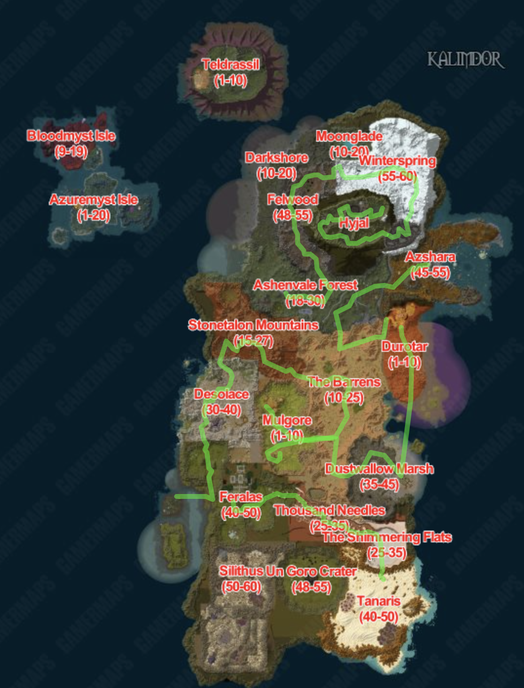
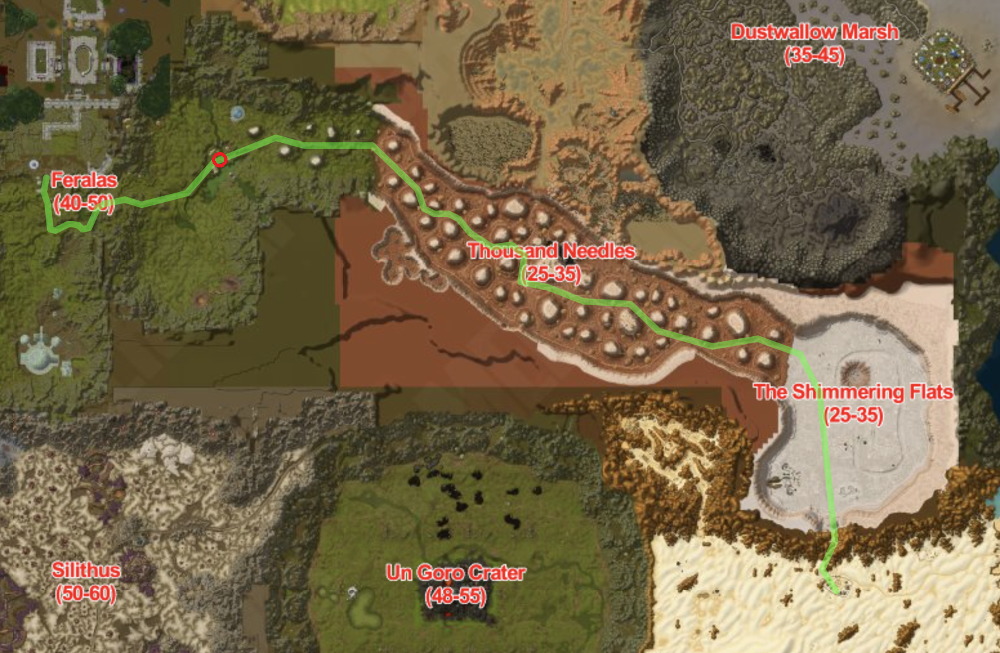
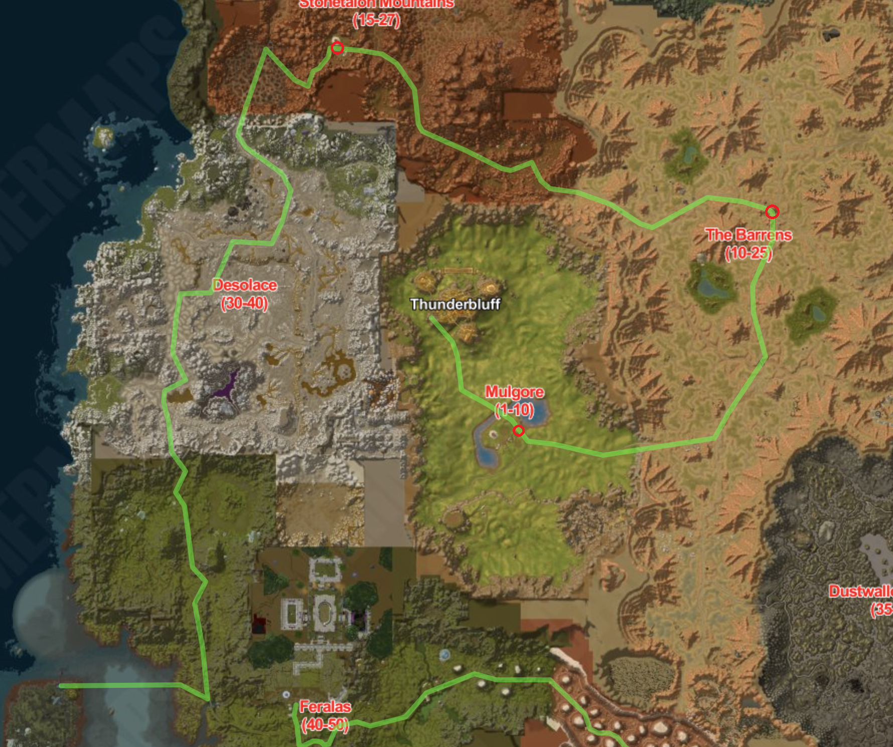
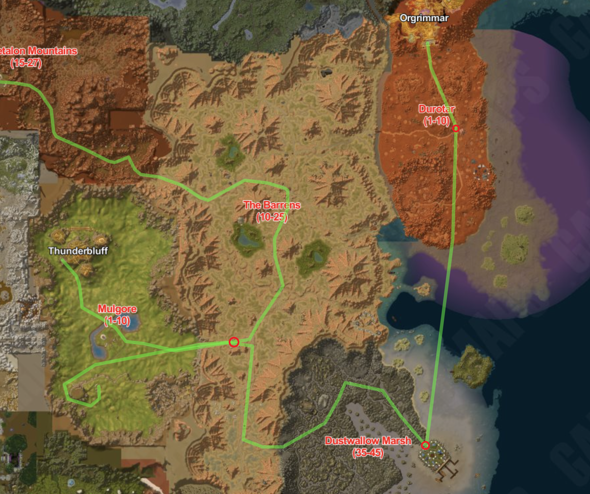
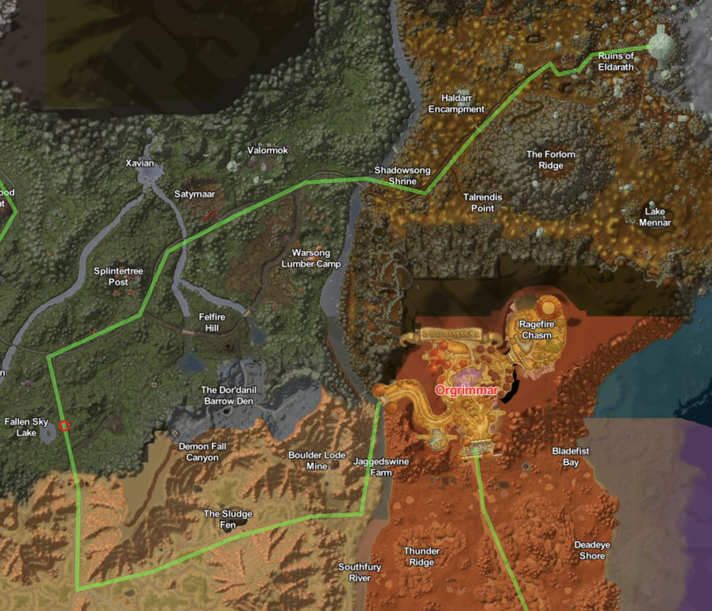
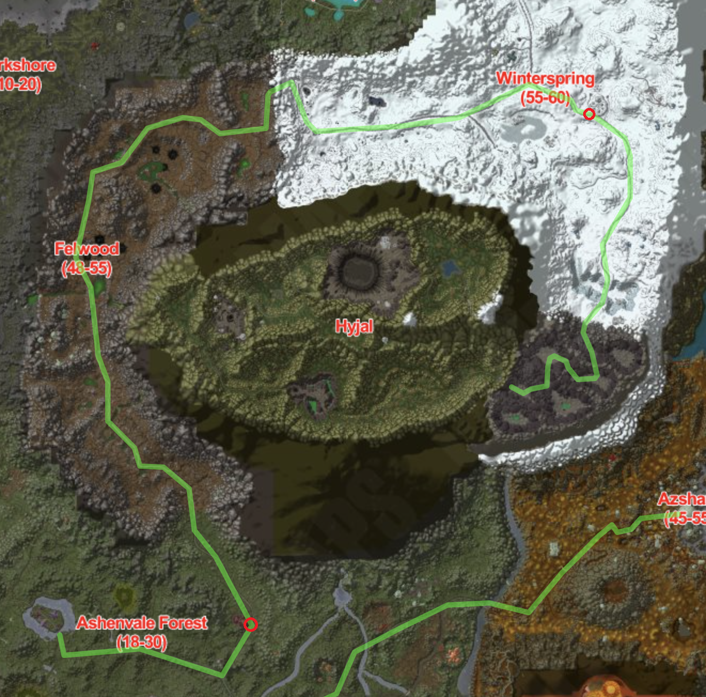
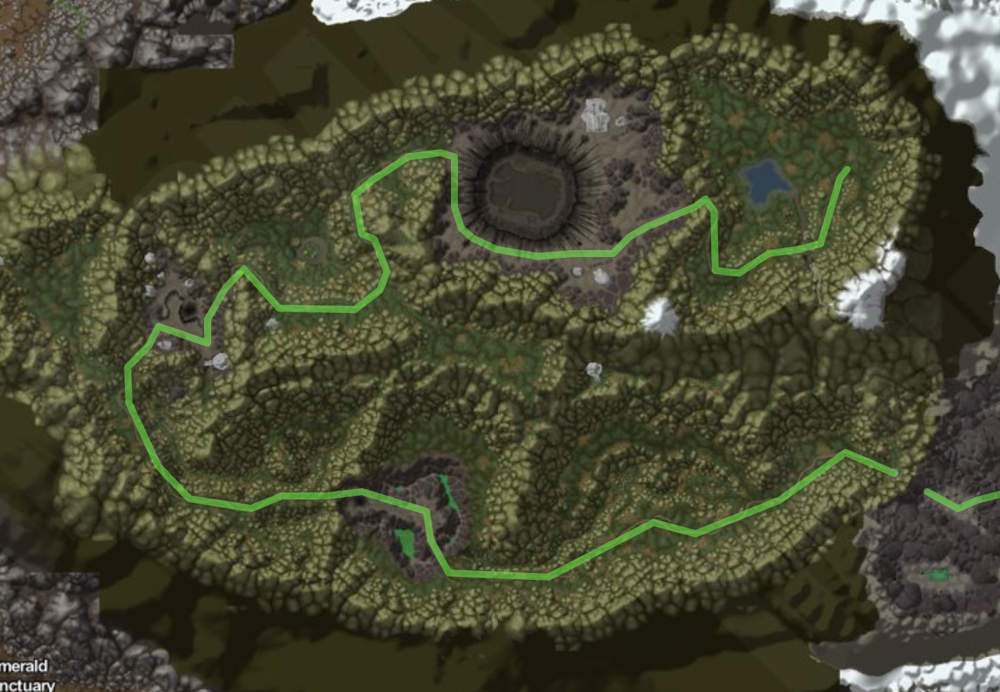

# Kalimdor

## Introduktion

Nu træder vi ind i Kalimdor - en verden af vilde landskaber, gamle mysterier og højspændte konfrontationer. Vores rejse fører os fra det forrevne Dire Maul's forhistoriske skove, gennem det imponerende Orgrimmar og videre op til det majestætiske og intense Mount Hyjal. Denne rejse vil udfordre vores modstandskraft, vække nysgerrighed og tage os på en oplevelse fyldt med kontraster og intensitet.


### Etape 12 Gadgetzan to Diremall

#### Introduktion

Rejsen fra Gadgetzan til Dire Maul fører os gennem en kontrastfyldt rute gennem Thousand Needles og Camp Mojache. Vi begynder vores eventyr i Gadgetzan, en livlig oase i Tanaris' tørre ørken, og fortsætter ind i det dramatiske landskab i Thousand Needles, inden vi når frem til den mytiske ruinby Dire Maul i Feralas.

Vores rute fører os gennem Thousand Needles, et landskab formet af dybe kløfter og søer. Denne forrevne region, der engang var et frodigt område, er nu blevet omdannet af kraftfuld magi og katastrofer til en tør og gold ørken.

Efter at have krydset det unikke terræn i Thousand Needles, når vi frem til Camp Mojache i Feralas. Her finder vi en fredelig oase midt i skovene og bjergene. Camp Mojache er en velkommen hvilepause, hvor Horde-styrker har slået lejr og opretholder en harmoni med naturen. Denne lejr er et symbol på samspillet mellem kultur og omgivelser.

Fra Camp Mojache fortsætter vi mod Dire Maul, en legendarisk ruinby beliggende i hjertet af Feralas' skov. Dette sted er kendt for sin forbindelse til druiderne og de gamle magier, der engang var fremherskende her. Mens vi bevæger os gennem skovstierne, nærmer vi os den gamle by, der er fyldt med historie og mytologi.

Rejsen fra Gadgetzan til Dire Maul er en opdagelsesrejse gennem en skiftende topografi i Thousand Needles og en fordybelse i den naturlige pragt i Camp Mojache. Denne rejse vil tage dig med på en episk færd gennem kontrastfyldte områder og byder på en oplevelse fyldt med ærefrygtindgydende naturlige vidundere og historiske mysterier.

#### Tour Niveau

På denne etape skal heltenes niveau være `30`. For at tilpasse heltens niveau til etapen kan følgende kommando bruges:

````
.reset level
.character level 29
````

#### Obligatorisk Checkpoint

* Camp Mojache

##### Start

````
.tele es12
````

##### Slut

````
.tele ee12
````

#### Kort



### Etape 13 Feathermoon Stronghold til Thunderbluff

#### Introduktion

Rejsen fra Feathermoon Stronghold til Thunderbluff tager os med på en ekspedition gennem nogle af Kalimdors mest forskelligartede og imponerende landskaber. Vi begynder vores færd fra Feathermoon Stronghold, en stolt bastion i for the Allicance. Dybt indlejret i den frodige skønhed af Feralas ligger Feathermoon Stronghold som en strålende perle i Kalimdors krone. Dette imponerende bastion er mere end bare en militærpost; det er et sted af historie, magi og sammenkomst. Feathermoon Stronghold udstråler en unik aura af mystik og fællesskab, der gør det til en særlig destination i Azeroths vidtrækkende lande.

Vores rejse fører os herefter gennem Desolace, et landskab formet af ødelæggelse og tab. Det er et sted med udfordringer og farer, hvor tidligere skove er blevet afløst af øde områder. Mens vi passerer gennem dette dystre område, reflekterer vi over de tidligere begivenheder og mærker tristheden, der hviler over landet.

Efter at have forladt Desolace stiger vi op til Sunrock Retreat i Stonetalon Mountains, et fredeligt sted beliggende højt i bjergene. Dette sted er en oase af ro og en perfekt kontrast til de tidligere udfordringer. Fra denne højde har vi en betagende udsigt over landskabet og føler os tættere på himlen.

Vores næste stop er The Crossroads i The Barrens, en central knudepunkt og mødested for både Horde og Alliance-rejsende. Dette sted er fyldt med liv og aktivitet, og det er et vidnesbyrd om de forskellige kræfter, der kæmper om kontrol i området. Vi oplever de pulserende energier og følelsen af spænding her.

Endelig når vi Thunderbluff i Mulgore, en storslået by bygget på klipperne og hjemsted for Tauren-folket. Byen er fyldt med kultur og stolthed, og udsigten over den store slette og de majestætiske mesas er betagende. Her er vores rejse gennem flere forskellige områder kulmineret, og vi kan reflektere over de forskellige landskaber og kulturer, vi har oplevet.

Rejsen fra Feathermoon Stronghold til Thunderbluff er en episk opdagelsesrejse gennem Desolace, Stonetalon Mountains og The Barrens. Gennem forladte områder, bjergskråninger og pulsrende krydsveje oplever vi en verden fyldt med kontraster og mangfoldighed. Denne rejse vil teste din udholdenhed, vække din nysgerrighed og tage dig med på en oplevelse, der illustrerer Azeroths rige landskaber og kulturer.

#### Tour Niveau

På denne etape skal heltenes niveau være `30`. For at tilpasse heltens niveau til etapen kan følgende kommando bruges:

````
.reset level
.character level 29
````

#### Obligatorisk Checkpoint

* Sunrock Retreat
* Crossroads
* Camp Taurajo

##### Start

````
.tele es13
````

##### Slut

````
.tele ee13
````

#### Kort



### Etape 14 Camp Narache til Orgimmar

#### Introduktion

Rejsen fra Camp Narache til Orgrimmar fører os gennem en række forskelligartede områder og landskaber, der er dybt indlejret i Horde's historie og kultur. Vi begynder vores eventyr i Camp Narache, en Tauren-lejr i Mulgore, og bevæger os gennem det centrale The Barrens, fortsætter til det strategiske Theramore Isle i Duskwallow Marsh og afslutter vores rejse i den mægtige hovedstad, Orgrimmar, i Durotar.

Fra Camp Narache ind i The Barrens oplever vi det vidtstrakte og barske terræn, der kendetegner dette område. Vilde savanner, tørre vidder og støvede veje skaber en følelse af uendelighed, mens vi bevæger os mod Camp Taurajo. Denne vigtige lejr er et symbol på Horde's styrke og kampvilje og er et afgørende knudepunkt i The Barrens.

Efter at have passeret Camp Taurajo, bevæger vi os ind i Duskwallow Marsh og støder på Theramore Isle. Theramore Isle er også en smuk destination, hvor det klare turkisfarvede vand og hvide sandstrande giver en idyllisk kontrast til de omgivende sumpe. Byens strukturer er en blanding af Alliance's arkitektur og øens naturlige skønhed, og dette bidrager til øens unikke atmosfære. Øens historie er dybt vævet ind i Azeroths historie. Det var på Theramore Isle, at Jaina Proudmoore forsøgte at opbygge broer mellem Alliance og Horde i en tid med konflikt.

Slutteligt når vi Orgrimmar i Durotar, en hovedstad, der emmer af Horde's kultur og styrke. Højt hævet over det tørre landskab i Durotar rejser Orgrimmar sig som et monument over Horde's styrke og sammenhold. Denne imponerende hovedstad, opkaldt efter den legendariske Orgrim Doomhammer, er mere end blot et centrum for aktiviteter; det er en manifestation af Horde's kultur, værdier og viljestyrke.

Rejsen fra Camp Narache til Orgrimmar er en episk oplevelse gennem forskellige aspekter af Horde's historie og samfund. Fra vidderne i The Barrens til de politiske diskussioner på Theramore Isle og ind i hjertet af Horde's kultur i Orgrimmar, oplever vi en verden fyldt med mangfoldighed og dynamik. Denne rejse vil teste din udholdenhed, vække din nysgerrighed og tage dig med på en oplevelse, der illustrerer Azeroths levende historie og folkesjæl.

#### Tour Niveau

På denne etape skal heltenes niveau være `35`. For at tilpasse heltens niveau til etapen kan følgende kommando bruges:

````
.reset level
.character level 34
````

#### Obligatorisk Checkpoint

* Camp Taurajo
* Theramore Isle
* Razorhill

##### Start

````
.tele es14
````

##### Slut

````
.tele ee14
````

#### Kort



### Etape 15 Orgrimmar til Ruins of Eldarath

#### Introduktion

Rejsen fra Orgrimmar til Ruins of Eldarath er en episk opdagelsesrejse gennem en mangfoldig række af Azeroths landskaber. Vi begynder vores eventyr i Orgrimmar, Horde's stolte hovedstad, og bevæger os gennem de udfordrende The Barrens, ind i det fortryllende Ashenvale Forest og endelig når vi frem til Ruins of Eldarath i Azshara.

Vores rute fører os gennem The Barrens, et område, der er præget af uendelige vidder og tørre sletter. Denne barske region er et symbol på Horde's viljestyrke og overlevelsesinstinkt, da dets folk har lært at trives i dette hårdføre landskab. På vores vej møder vi både truende skabninger og øde områder, der tjener som en påmindelse om Azeroths udfordringer.

Efter at have krydset The Barrens, bevæger vi os ind i Ashenvale Forest, en skov af utallige skønheder og mysterier. Her ændrer landskabet sig dramatisk, og træer og vegetation skaber en tæt og pulserende atmosfære. Dybe skovstier og fortryllende lys gør det til et malerisk område, der skaber en stærk kontrast til den tidligere ørken.

Endelig når vi til hjertet af Azshara, The Ruins of Eldarath. Omgivet af forblæste klipper og ombruste kyster, står Eldarath som et stumt vidner til en engang blomstrende og storslået civilisation. Dette gamle sted, fyldt med forfald og mystik, er mere end blot ruiner; det er et vindue ind i Azeroths fortid og en påmindelse om, at selv de mest magtfulde imperier kan falde.

Ruins of Eldarath bærer spor af en højtudviklet kultur, der en gang trivedes her. De forreste kolonner og snørklede relieffer på de tilbageblevne bygningsværker fortæller en historie om en civilisation, der beherskede arkitektur, kunst og magi. Disse ruiner, der nu er overtaget af forfald og tidens tand, fortæller om de gloriøse dage og tragiske begivenheder, der har formet stedet.

Rejsen fra Orgrimmar til Ruins of Eldarath er en rejse gennem kontraster - fra det barske The Barrens, gennem den fortryllende Ashenvale Forest, og til de forhistoriske Ruins of Eldarath. Undervejs oplever vi Azeroths skiftende skønheder og udfordringer. Denne rejse vil teste din udholdenhed, vække din nysgerrighed og tage dig med på en oplevelse fyldt med mangfoldighed og historie.

#### Tour Niveau

På denne etape skal heltenes niveau være `40`. For at tilpasse heltens niveau til etapen kan følgende kommando bruges:

````
.reset level
.character level 39
````

#### Obligatorisk Checkpoint

* The Fallen Sky Lake

##### Start

````
.tele es15
````

##### Slut

````
.tele ee15
````

#### Kort



### Etape 16  Astranaar til Hyjal Indgang

#### Introduktion

Rejsen fra Astranaar til Hyjal fører os gennem et landskab, der strækker sig fra det forurenede til det iskolde, og til sidst til et sted af mytiske proportioner. Vi begynder vores rejse fra Astranaar i Ashenvale, bevæger os gennem det forgiftede Felwood, fortsætter til det tågede Everlook i Winterspring og endelig når vi indgangen til det legendariske Hyjal.

Vores rejse begynder i Astranaar, en fredelig enklave i Ashenvale's skov, hvor naturen og Alliancens tilstedeværelse går hånd i hånd. Da vi forlader Astranaar, bevæger vi os ind i Felwood, et område, der er blevet forvandlet af korruption og forfald. De forurenede træer og den dystre atmosfære tjener som en påmindelse om, hvordan Azeroth kan blive forandret af mørke kræfter.

Fra Felwood fører vejen os til Everlook i Winterspring, en by beliggende i en evig tåge og omgivet af snedækkede landskaber. Det er et sted, hvor de modige og eventyrlystne samles, og hvor folk udforsker de kolde vidder i jagten på skatte og udfordringer. Den skiftende atmosfære fra Felwoods forrådnelse til Wintersprings klare kulde skaber en stærk kontrast og udtrykker Azeroths variation.

Slutteligt når vi indgangen til Hyjal, en mytisk og legendarisk lokalitet i Azeroths historie. Denne destination er omgivet af mystik og eventyr, og dens betydning strækker sig dybt ind i verdenshistorien. Det er et sted, hvor naturens kræfter og de begivenheder, der har formet Azeroth, kommer sammen på en episk måde.

Rejsen fra Astranaar til Hyjal er en rejse gennem Azeroths varierede og dynamiske landskaber. Fra den naturlige skønhed i Astranaar til Felwoods forurening, fra Wintersprings tågede kulde til Hyjals legendariske betydning. Denne rejse vil teste vores mod, vække nysgerrighed og tage os på en oplevelse fyldt med kontraster, udfordringer og historie.

#### Tour Niveau

På denne etape skal heltenes niveau være `60`. For at tilpasse heltens niveau til etapen kan følgende kommando bruges:

````
.reset level
.character level 59
````

#### Obligatorisk Checkpoint

* Raynewood Retreat
* Everlook

##### Start

````
.tele es16
````

##### Slut

````
.tele ee16
````

#### Kort



### Etape 17 Mount Hyjal (Sprint)

#### Introduktion

Rejsen fra bunden af Mount Hyjal til det udbrændte World Tree er en rejse gennem Azeroths dybeste historie og tragiske begivenheder. Vi begiver os op ad det hellige bjerg og gennem skovene, hvor vi engang kæmpede sammen med legendariske helte for at beskytte Azeroth mod den mørke fjende, Archimonde.

Vores rejse begynder ved foden af Mount Hyjal, en mytisk bjergkæde, der har været vidne til nogle af Azeroths mest afgørende øjeblikke. Det var her, at Alliance og Horde samledes for at bekæmpe Archimonde og The Burning Legion i en episk konfrontation. I denne storslåede kamp blev Azeroths helte enige om at stå sammen og kæmpe for verdens overlevelse.

Op ad stien, omgivet af frodige skove og dyb natur, går vi gennem de steder, hvor slaget mod Archimonde fandt sted. Historiens ekko kan stadig mærkes i luften, og det er som om, de tapre krigere, der gav alt for at forsvare Azeroth, stadig er til stede i hvert træ og sten.

Endelig når vi Det Udbrændte World Tree, engang kaldet Nordrassil, hjertet af naturens pulserende kræfter og livets strøm. Dets en gang fortryllede blade glødede med en vitalitet og fremtidshåb, men de er nu forkullet og falmede som konsekvensen af Archimondes rasende hærgen. Her, tronende højt oppe i træets knækkede krone, svæver Archimondes skelet stadig som en skrækindjagende monument over The Burning Legions uovervindelige magt. Dog er det også en ufravigelig påmindelse om, at når Azeroths helte står sammen i en urokkelig enhed, formår de at besejre selv de mest umulige udfordringer.

Rejsen fra bunden af Mount Hyjal til det udbrændte World Tree er mere end en fysisk tur gennem landskaber. Det er en rejse gennem tid og minder, der minder os om Azeroths evne til at samle sig i ansigtet af trusler. Det Udbrændte World Tree står som et monument over sejr og tab, og Archimondes skelet hænger som en advarsel om, at selv de mægtigste fjender kan blive besejret af en forenet front.

#### Tour Niveau

På denne etape er niveau ikke relevant.

#### Obligatorisk Checkpoint

##### Start

````
.tele es17
````

##### Slut

````
.tele ee17
````

#### Kort


