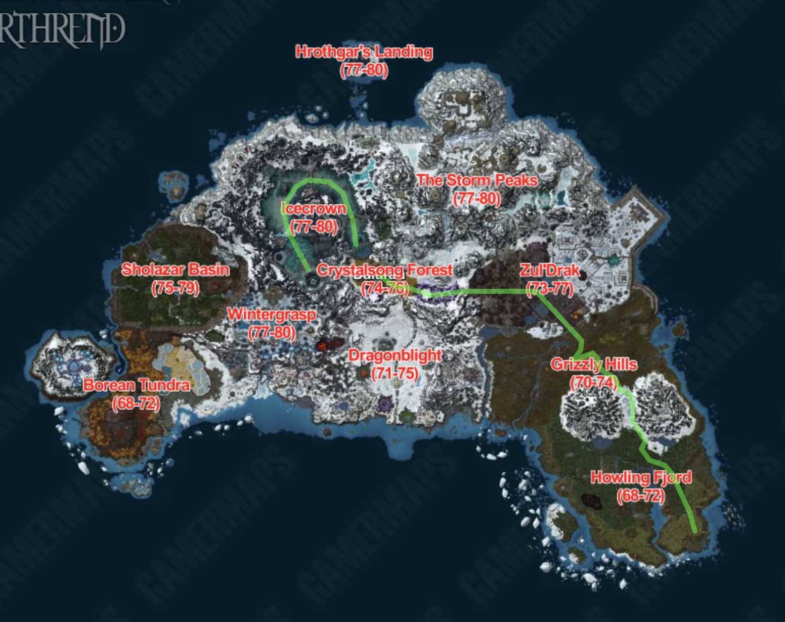
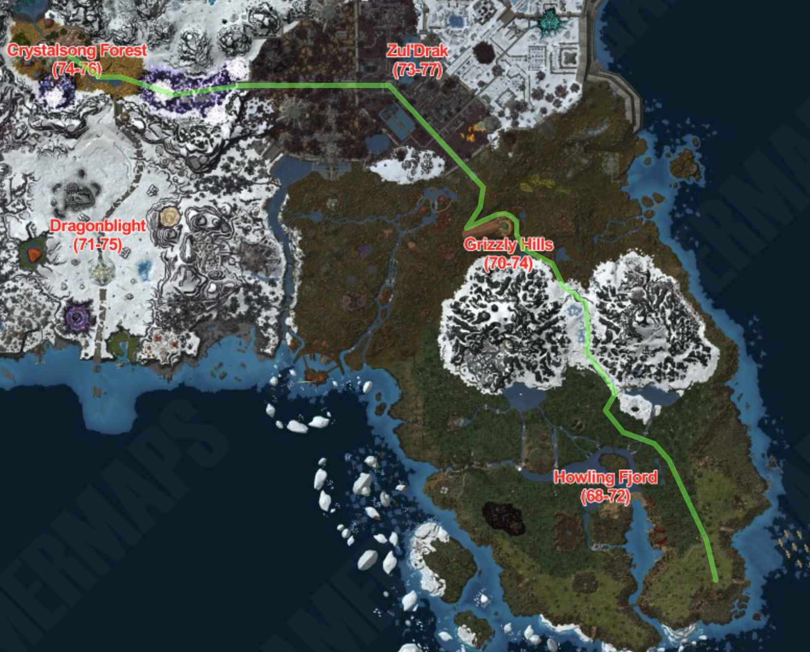
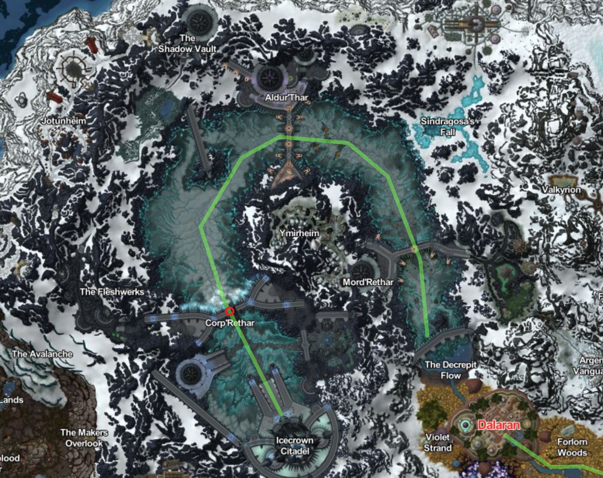

# Northrend

## Introduktion

Nu begiver vi os til Northrend - en verden af iskolde vidundere, episke konflikter og skæbnesvangre øjeblikke. Vores rejse fører os fra frodige grønne områder omkring Grizzly Hils, gennem den gådefulde Rift Vally i Icecrown.. Denne rejse vil teste vores beslutsomhed, vække vores eventyrlyst og tage os med på en oplevelse fyldt med kontraster og drama.



### Etape 6 Explores League Outpost to Dalaran

#### Introduktion

Rejsen fra Explorer's League Outpost til Dalaran er en opdagelsesrejse gennem nogle af Azeroths mest enestående og mangfoldige områder. Vi begynder vores færd fra Explorer's League Outpost, hvor eventyret venter på os.

Vi drager først gennem Grizzlemaw, et område i Grizzly Hills, hvor tætte skove og snedækkede bjerge skaber en betagende kulisse. Grizzlemaw har et tæt forhold til Grizzly Hills' Ursoc, en mektig bjørneånd, der engang beskyttede området. Mens vi rejser gennem disse skove, oplever vi forbindelsen til naturen og den åndelige arv, der strækker sig tilbage i tiden.

Vores næste stop er The Argent Stand i Zul'Drak, et område præget af skæbnesvangre kampe og arkaiske ruiner. The Argent Stand tjener som et bastion for Argent Crusade, en organisation, der kæmper mod den frygtelige Scourge-plage. Her er vores mod og styrke sat på prøve, mens vi navigerer gennem det konstante kamphelvede og mindes de, der har ofret alt i kampen mod undeath.

Fra Zul'Drak fortsætter vi til The Unbound Thicket i Crystalsong Forest, hvor en aura af mystik og fortryllelse fylder luften. Dette skovområde er hjemsted for de æteriske, væsener fra en anden virkelighed, der er forbundet med magi og uforklarlige kræfter. Her oplever vi et område, hvor virkeligheden smelter sammen med det overnaturlige, og vores sind udforsker det ukendte.

Endelig når vi Dalaran, en magisk by svævende over Crystalsong Forest. Dalaran er hjemsted for mægtige magikere og intellektuelle, der har sat sig for at forstå Azeroths dybeste mysterier. Byen har også været en nøgleaktør i mange af Azeroths begivenheder og konflikter og symboliserer foreningen af magi og historie.

Rejsen fra Explorer's League Outpost til Dalaran er en episk opdagelsesrejse gennem Grizzlemaw, The Argent Stand og The Unbound Thicket. Mens vi bevæger os gennem disse områder, oplever vi en verden fyldt med natur, kamp og mystik, der vidner om Azeroths rige historie og mangfoldighed.

#### Obligatorisk Checkpoint

* Grizzlemaw
* The Argent Stand
* The Unbound Thicket

##### Start

````
.tele es6
````

##### Slut

````
.tele ee6
````

#### Kort



### Etape 7 Icecrown (Sprint)

#### Introduktion

Rejsen rundt om bjerget i midten af Icecrown, gennem The Rift Valley of Icecrown, er en opdagelsesrejse gennem nogle af Azeroths mest udfordrende og forrevne områder. Vi begynder vores færd fra The Decrepit Flow, et dystert landskab fyldt med forfald og isnende vinde.

Undervejs følger vi bjerget, hvis spidser skaber en imponerende kulisse på horisonten. Vi befinder os i The Rift Valley der er en dyb kløft, der har delt landskabet og formet terrænet. Denne kløft er fyldt med elementer af både skønhed og fare, og vi må bevæge os med forsigtighed gennem dets komplekse landskab.

The Rift Valley skaber en følelse af afskærmning, da de stejle klippesider stiger højt over os. Dette område har været vidne til skæbnesvangre kampe og konflikter, der har sat deres spor på dalens jord. Det er en påmindelse om Azeroths urolige historie og de utallige kampe, der er blevet udkæmpet.

Vores rejse kulminerer, når vi nærmer os indgangen til Icecrown Citadel, en imponerende fæstning beliggende på bjergets top. Den mørke portal symboliserer Lich King's dystre dominans og minder os om de mørke kræfter, der hviler over Icecrown.

Rejsen rundt om bjerget i midten af Icecrown gennem The Rift Valley er en udfordring af vores udholdenhed og mod, mens vi navigerer gennem dette barske og forrevne terræn.

#### Obligatorisk Checkpoint

* Corp'Rethar

##### Start

````
.tele es7
````

##### Slut

````
.tele ee7
````

#### Kort


