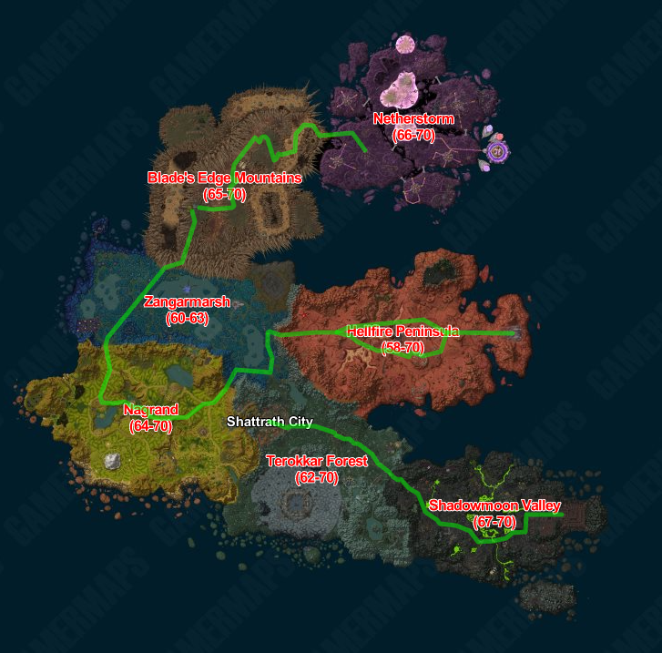
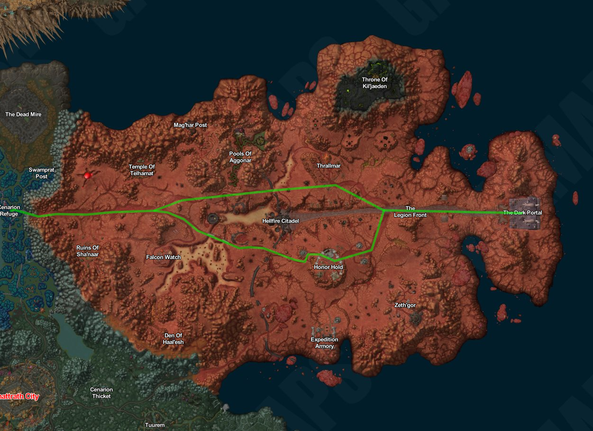
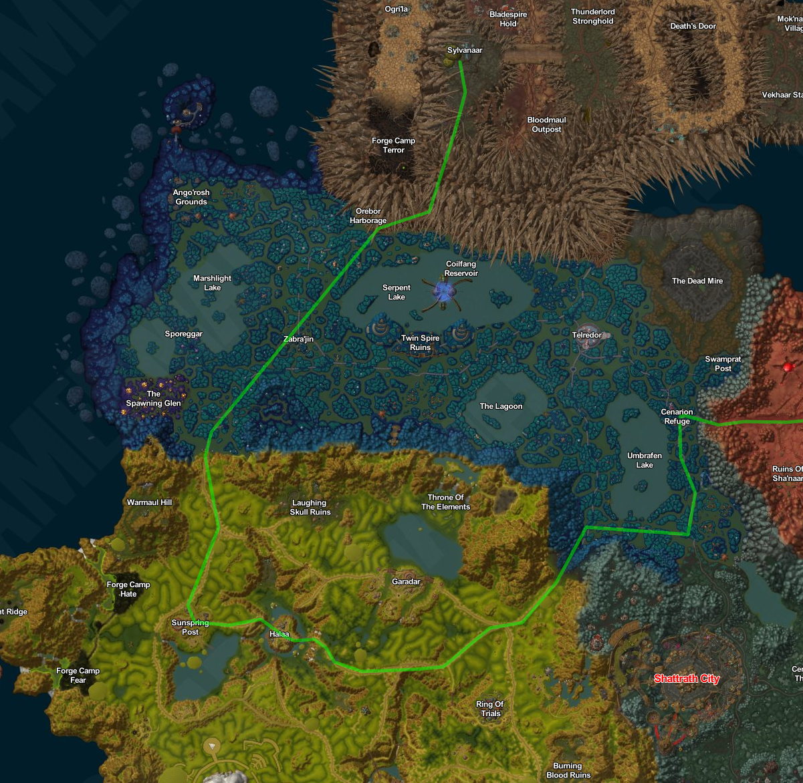
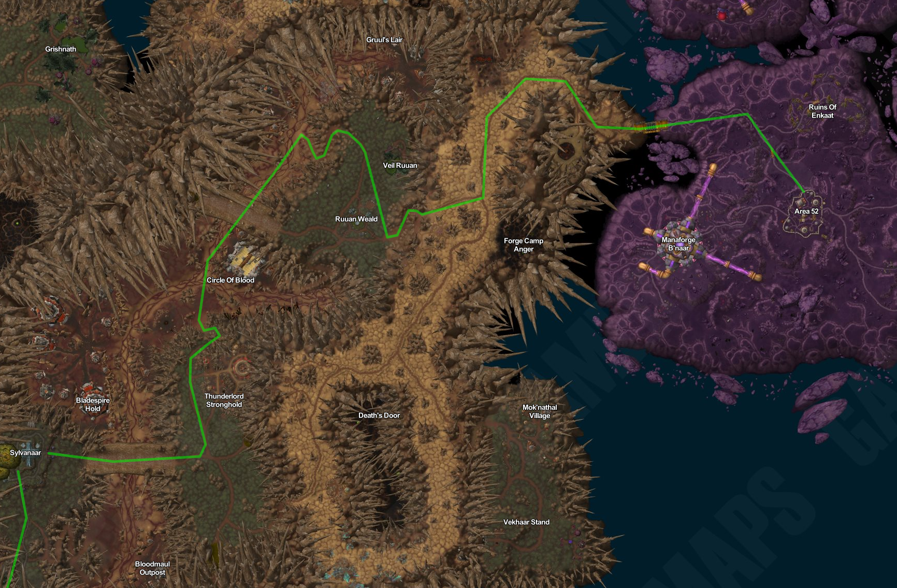

# Outlands

## Introduktion

Nu går turen til Outland - en verden af magi, teknologi og skæbne. Fra den idylliske oase i Cenarion Refuge til de imponerende Blade's Edge Mountains, videre gennem det futuristiske Netherstorm til det dystre The Black Temple i Shadowmoon Valley. Denne beskrivende rejse vil udfordre din mod, vække din nysgerrighed og tage dig med på en oplevelse fyldt med skønhed og mystik.



### Etape 8 (Sprint) The Dark Portal til Cenarion Refuge

#### Introduktion

Rejsen fra The Dark Portal til Cenarion Refuge er en episk odyssé gennem det frodige og farlige landskab i Outland. Ved The Dark Portal, der står som en majestætisk, forvrænget portal mellem Azeroth og Outland, begynder vores eventyr. Stedet emmer af historie og drama, som området engang var et afgørende punkt for horder af dæmoniske invasionsstyrker, der trængte ind i Azeroth.

Vores første skridt fører os gennem det ødelagte Hellfire Peninsula, hvor udtørrede, knuste landskaber står i skarp kontrast til den buldrende lavas sprøjtende glød. Sorte, tornede skygger trækker deres spor i jorden, og et atmosfære af hårdhed omgiver os, mens vi bevæger os dybere ind i Outlands hjerte.

Efterhånden som vi forlader det dystre Hellfire Peninsula, åbner den spredte grønne vegetation sig som en oase i det golde landskab. Vi betragter med ærefrygt den himmelstræbende Blade's Edge Mountains, hvor massive klipper står som monumenter over tidens forandringer. Disse bjerge beskytter det bortgjemte græsland, Zangarmarsh, som vi nærmer os.

Zangarmarsh byder os velkommen med et hav af smaragdgrønne vandmasser og sumpede områder, der er hjemsted for utallige eksotiske planter og skabninger. Flydende paddehatte svæver som skæve kasketter på vandets overflade, mens glødende svampe lyser som lanterner i mørket. En harmonisk, men alligevel skrøbelig balance, findes i dette unikke økosystem.

Vi nærmer os Cenarion Refuge, og stemningen skifter igen. En følelse af ro og harmoni fylder luften, når vi træder ind i dette naturlige tilflugtssted. Den smukke og fredelige lagune, hvor det luminescerende vand spejler stjernerne om natten, giver en følelse af magi og trylleri. Her møder vi også de beskyttende druider fra Cenarion Circle, der vogter over denne skrøbelige oase.

Rejsen fra The Dark Portal til Cenarion Refuge er en udfordrende, men også en vidunderlig rejse gennem Outlands mangfoldige landskaber. Den byder på alt fra dystre og øde områder til frodige skove og betagende sumpområder. Det er en prøvelse af mod og udholdenhed, men også en opdagelsesrejse fyldt med fascination og ærefrygt for denne enestående verden.

#### Obligatorisk Checkpoint

* Honor Hold / Thrallmar

##### Start

````
.tele es8
````

##### Slut

````
.tele ee8
````

#### Kort



### Etape 9 Cenarion Refuge til Sylvanaar

#### Introduktion

Rejsen fra Cenarion Refuge til Sylvanaar er en uforglemmelig ekspedition gennem den majestætiske verden af Nagrand i Outland. Vi begynder vores færd fra den rolige oase i Cenarion Refuge, hvor den beroligende lyd af klukkende vand og fuglesang ledsager os på vores vej.

Vi forlader den fredelige lagune bag os og bevæger os ind i Nagrand, hvor det frodige græsland strækker sig så langt øjet kan se. Græsset bølger som en endeløs hav af grønt, hvor vilde kreaturer græsser i harmoni. Den varme, blide brise bærer duften af vilde blomster og naturens renhed.

Snart ser vi den store fæstning Halaa i det fjerne. Dette gamle bastion står stolt midt i Nagrand, og dets ruiner vidner om fortidens stridigheder. Vi nærmer os, og omgivelserne bliver mere spændte. Ruinernes forladte stemning blander sig med en aura af mystik og ærefrygt.

Efter at have udforsket Halaa og ladet dets historie synke ind, fortsætter vi vores rejse gennem det kuperede terræn. Den udfordrende stigning belønner os med en betagende udsigt fra toppen. Sylvanaar venter stadig i horisonten, som en træby, der synes at være et fredeligt tilflugtssted midt i denne vilde natur.

Inden vi når Sylvanaar, tager vi en afstikker til Zabra'jin, der ligger i Zangarmarsh. Her bliver vi mødt af et landskab, der er helt anderledes end det tidligere. Vandet, der glimter som smaragder, omgiver os, og flydende paddehatte svæver som skæve kasketter på vandets overflade. Den sumpede atmosfære skaber en mystisk kulisse for vores rejse.

Efter at have udforsket Zabra'jin og beundret dets unikke charme, fortsætter vi videre mod Sylvanaar. Da vi nærmer os, bliver vi budt velkommen af duften af træ og en følelse af varme fra dens indbydende indbyggere. Byen er omgivet af stolte træer, der danner en naturlig barriere og giver en følelse af tryghed og beskyttelse. Selve byen emmer af aktivitet, og beboerne går rundt med et venligt smil og glæde.

Turen fra Cenarion Refuge til Sylvanaar gennem Halaa og Zabra'jin er en unik rejse gennem Outlands mangfoldige landskaber. Fra Nagrands frodige græsland til Zangarmarsh' sumpede områder oplever vi naturens forskellighed og Outlands rige historie og kultur. Det er en rejse fyldt med opdagelser, eventyr og en fordybelse i naturens vidunderlige skaberværk.

#### Obligatorisk Checkpoint

* Halaa
* Zabra'jin

##### Start

````
.tele es9
````

##### Slut

````
.tele ee9
````

#### Kort



### Etape 10 Sylvanaar til Area 52

#### Introduktion

Rejsen fra Sylvanaar til Area 52 er en spændende og futuristisk færd gennem Outlands forrevne landskaber. Efter at have forladt Sylvanaar, forsvinder de grønne skovområder gradvist, og vi begiver os ind i Blade's Edge Mountains. Bjergene rejser sig majestætisk omkring os, og vi følger en snoet sti, der fører os højere og højere op i højderne.

Mens vi klatrer, ændrer landskabet sig drastisk. Grønne områder erstattes af golde klippeformationer, og vi bliver vidne til enestående klippesider og afgrunde, der vil tage pusten fra enhver. Men denne barske skønhed er også ledsaget af en følelse af afsideshed og ensomhed, da kun de mest eventyrlystne drister sig ind i disse udfordrende territorier.

Efter at have kæmpet os igennem Blade's Edge Mountains, begynder omgivelserne at skifte igen, når vi nærmer os Netherstorm - det område, hvor Area 52 befinder sig. Den blålige himmel bliver gradvist erstattet af elektrisk glødende skyer, og vi kan mærke den spændende følelse af teknologisk fremgang i luften.

Når vi træder ind i Netherstorm, mødes vi af en surrealistisk og futuristisk verden. Flyvende skibe svæver i horisonten, og lyn og energistråler danser omkring os. Vi står over for mageløse skaber, der virker som noget fra en anden verden. Området er præget af avanceret teknologi og arcanas kraft, og det er tydeligt, at vi er trådt ind i et område, hvor videnskab og magi forenes.

Endelig ser vi Area 52 i al sin pragt. Dette avancerede forskningskompleks er hjertet af Netherstorm og en kilde til innovation og opdagelse. En intens aktivitet hersker omkring os, da videnskabsfolk og teknikere arbejder sammen om at afdække Outlands hemmeligheder.

Rejsen fra Sylvanaar til Area 52 er en bemærkelsesværdig rejse gennem en mangfoldig verden, hvor naturens rå skønhed møder futuristisk teknologi og arkana magi. Fra bjergtoppe til elektrisk glødende landskaber får vi et glimt af Outlands utrolige variation og fascinerende kultur. Det er en rejse fyldt med eventyr, udfordringer og en fordybelse i Outlands unikke vidundere.

#### Obligatorisk Checkpoint

##### Start

````
.tele es10
````

##### Slut

````
.tele ee10
````

#### Kort



### Etape 11 Shattrath City til The Black Temple

#### Introduktion

Rejsen fra Shattrath City til The Black Temple er en afgørende og skæbnesvanger færd gennem Outland. Shattrath City, byen med sine blendende tårne og fortryllende arkitektur, udstråler en aura af fred og forening, da det er et sted, hvor både Alliance og Horde kan finde ly og samles i harmoni.

Vi begiver os ud af byens beskyttende mure og begynder vores rejse mod The Black Temple, der ligger i Shadowmoon Valley. Vejen fører os gennem en række betagende landskaber, hvor det golde terræn fra Terokkar Forest gradvist bliver erstattet af den mørke og mystiske aura i Shadowmoon Valley.

Som vi bevæger os dybere ind i dalen, er det som om, tiden går i stå. Mørke træer og mystiske stenformationer omgiver os, og atmosfæren bliver tæt med en følelse af historie og skæbne. En dyster ro hersker i området, men en ubestridelig styrke trænger sig på, da vi nærmer os The Black Temple.

The Black Temple står som en skræmmende bastion af ondskab og mørke. Bygget ind i klipperne, virker det som en uigennemtrængelig fæstning. Dette dystre sted er hjemsted for Illidan Stormrage, en magtfuld og kontroversiel skikkelse, der har skabt frygt og fascination i Outland.

Det er en rejse gennem et landskab præget af både skønhed og dystre hemmeligheder. Det er en rejse, der vil teste os, udfordre os og vise os, hvad vi er i stand til, når vi konfronteres med det uventede og det farlige. Rejsen fra Shattrath City til The Black Temple er en episk færd, der vil efterlade et uudsletteligt aftryk på vores sjæle og forankre os endnu dybere i Outlands rige historie og magiske verden.

#### Obligatorisk Checkpoint

* Tuurem
* Sanctum of The Stars

##### Start

````
.tele es11
````

##### Slut

````
.tele ee11
````

#### Kort


